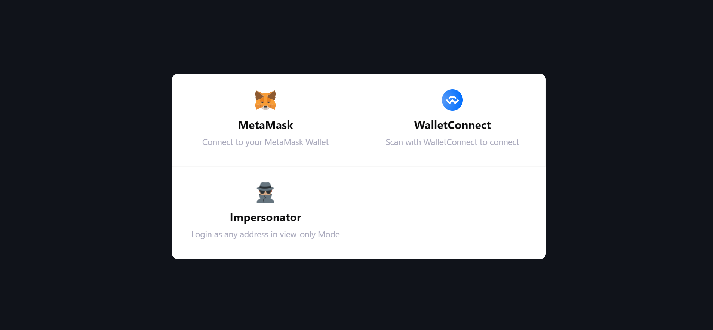
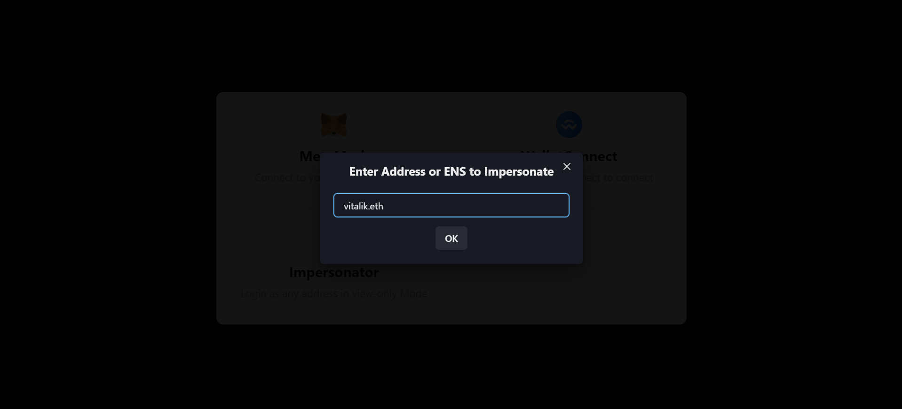

# @impersonator/web3modal-test

Sample React application to test <a href="https://www.npmjs.com/package/@impersonator/web3modal" target="_blank">`@impersonator/web3modal`</a> package.

## Set up:

1. Clone this repo
2. Install required packages with: `npm i` or `yarn`
3. Create `.env` file and set `REACT_APP_INFURA_ID=`
4. Run the app with `yarn start`

