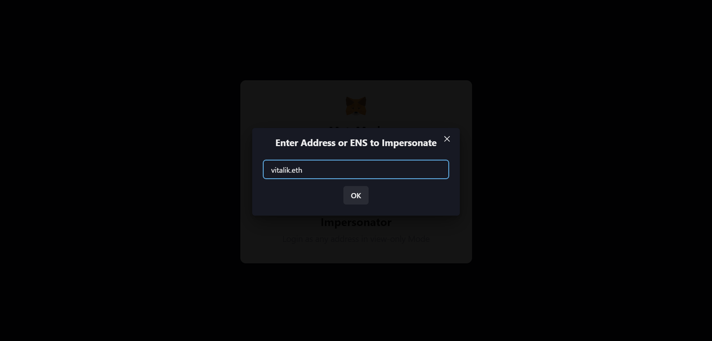

# @impersonator/web3modal

Add Impersonator as Custom provider to web3modal

## Usage

```typescript
import Web3Modal from "web3modal";
import { getImpersonatorProvider } from "@impersonator/web3modal";

const web3Modal = new Web3Modal({
  network: "mainnet", // optional
  cacheProvider: false, // optional
  providerOptions: {
    ...getImpersonatorProvider("<INSERT_RPC_URL>"),
  },
});
```



